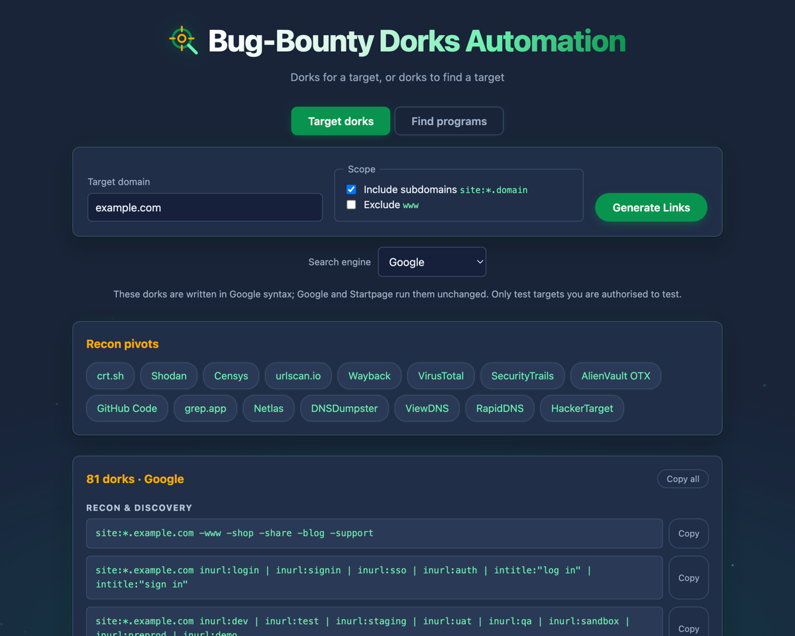
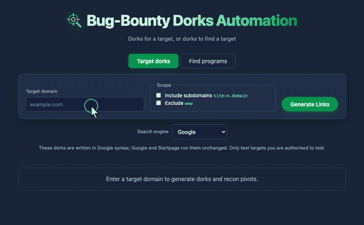

<p align="center">
  
</p>

<h1 align="center">Bug-Bounty Dorks Automation</h1>

<p align="center">
  Search-engine dorks for bug bounty, web application security and pentesting.
</p>

<p align="center">
  <a href="https://ashikkunjumon.github.io/Bug-Bounty-Dorks-Automation">
    </a>
  <a href="LICENSE">
    </a>
  
  
</p>

<p align="center">
  <b><a href="https://ashikkunjumon.github.io/Bug-Bounty-Dorks-Automation">Open the tool &rarr;</a></b>
</p>

<p align="center">
  
</p>

---

Two modes: dorks for a specific target, and dorks for finding programs to test.

## Target dorks

**81 dorks across 9 groups:**

| Group | Covers |
|---|---|
| Recon & discovery | Broad sweep, login/SSO, dev and staging, admin panels, API roots |
| API surface | Swagger/OpenAPI, GraphQL and GraphiQL, OIDC/SAML/JWKS, Spring Boot Actuator |
| Injection-prone params | XSS, SQLi, open redirect, SSRF, LFI, RCE, sensitive parameters |
| Exposed files | Configs, database dumps, private keys, `.env`, VCS directories, sensitive documents |
| Exposed services | Grafana/Kibana/Prometheus, Jenkins and CI, Kubernetes and Docker, Jira/Confluence, phpMyAdmin, stack traces |
| Secrets & tokens | Keys in JS, AWS/Google/Stripe/Slack/SendGrid/GitHub/Anthropic/OpenAI token prefixes, private key blocks |
| Credentials by name | Env-var names for AWS, GCP, Azure, databases, Stripe, Twilio, Slack, OpenAI/Anthropic, CI tokens, and `NEXT_PUBLIC_`/`REACT_APP_` build-time leakage |
| Off-site exposure | S3/GCS/Azure/R2, Firebase, paste sites, code sandboxes, GitHub/GitLab, Google Docs, Trello/Notion, Postman, disclosed reports |
| CMS & platforms | WordPress, Drupal, Joomla, AEM, Sitecore/Umbraco/TYPO3/Magento, Next/Nuxt/Shopify |

- **Scope controls** — toggle `site:*.domain` to sweep subdomains, or exclude `www`.
- **Off-site dorks** search third-party hosts for mentions of your target instead of the target itself. That is what turns up buckets, pastes and public docs.
- **15 recon pivots** — crt.sh, Shodan, Censys, urlscan.io, Wayback, VirusTotal, SecurityTrails, AlienVault OTX, GitHub code search, grep.app, Netlas, DNSDumpster, ViewDNS, RapidDNS, HackerTarget.

## Find programs

**79 dorks across 9 groups:** disclosure pages, `security.txt`, platform
fingerprints, reward language, hall-of-fame pages, policy documents, safe-harbour
wording, crypto and web3, and non-English policies.

**26 languages**, each dork labelled with its language in the results:

| Region | Languages |
|---|---|
| Western Europe | German, French, Spanish, Italian, Portuguese, Dutch |
| Nordics | Swedish, Norwegian, Danish, Finnish |
| Central & Eastern Europe | Polish, Czech, Hungarian, Romanian, Greek, Russian, Ukrainian |
| Middle East | Turkish, Hebrew, Arabic |
| Asia-Pacific | Japanese, Chinese, Korean, Thai, Vietnamese, Indonesian |

Each dork pairs the native phrasing for reporting a vulnerability with the local
term for responsible disclosure or a reward. Most organisations publish these
pages only in their own language, so English-only dorks miss them.

- **Region and sector scoping** — one picker covering `.edu`, `.gov`, `.mil` and 52 country TLDs, applied to every dork at once.
- **Language follows region.** `.jp` searches Japanese. `.ch` searches German, French and Italian. English-speaking regions drop the language dorks entirely, and `.jp` never gets German phrasing, because those combinations return nothing.
- **16 program directories** — HackerOne, Bugcrowd, Intigriti, YesWeHack, Open Bug Bounty, disclose.io, huntr, Immunefi, HackenProof, Federacy, Zerocopter, GoBugFree, Bug Bounty CH, Secuna and more.

## Both modes

- **Six search engines with operator translation** — the dorks are Google syntax; Google and Startpage run them unchanged. Bing dropped `inurl:` in 2007 and has no `intext:`, and Yandex uses `mime:`/`host:` instead, so each query is rewritten per engine rather than just re-pointed. An unsupported operator degrades to a broader term instead of returning nothing.
- **Copy buttons** — grab a single dork or the whole set at once.
- **Shareable URLs** — the mode, target or region, and engine all live in the hash: `#target/example.com/bing`, `#programs/nl`.

Static files served from GitHub Pages. No build step, no dependencies, no tracking.

## Usage

<p align="center">
  
</p>

Enter a target and press Enter. `example.com`,
`https://example.com/login?next=/`, `*.example.com` and `example.com:8443` all
normalise to the same host.

In **Find programs** there is nothing to submit. Pick a region and the dorks
update as you go.

## Local development

```bash
git clone https://github.com/ashikkunjumon/Bug-Bounty-Dorks-Automation.git
cd Bug-Bounty-Dorks-Automation
python3 -m http.server 8000
```

Then open http://localhost:8000.

## Legal

For authorised security testing and research only. Dorking only surfaces content
that is already publicly indexed. Acting on what you find, against systems you do
not own or have permission to test, may be illegal. Staying inside the scope of
your engagement or bug bounty programme is your responsibility.

## License

Released under the [MIT License](LICENSE).

Copyright &copy; 2026 Ashik Kunjumon
